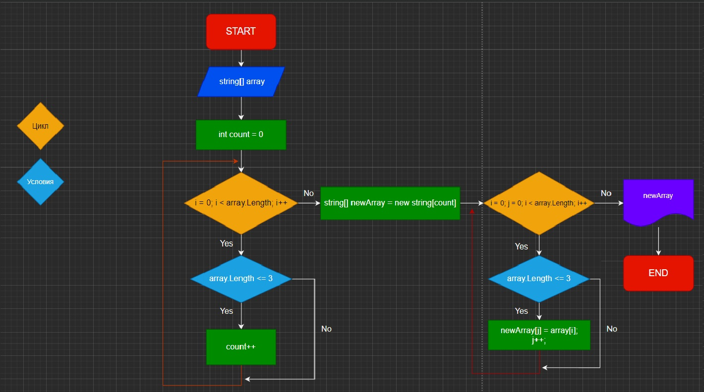

# Итоговая проверочная работа. FinishProjectSpecial

**Задача алгоритмически не самая сложная, однако для полноценного выполнения проверочной работы необходимо:**

1. Создать репозиторий на GitHub
2. Нарисовать блок-схему алгоритма (можно обойтись блок-схемой основной содержательной части, если вы выделяете её в отдельный метод)
3. Снабдить репозиторий оформленным текстовым описанием решения (файл README.md)
4. Написать программу, решающую поставленную задачу
5. Использовать контроль версий в работе над этим небольшим проектом (не должно быть так, что всё залито одним коммитом, как минимум этапы 2, 3, и 4 должны быть расположены в разных коммитах)
#

**Задача: Написать программу, которая из имеющегося массива строк формирует новый массив из строк, длина которых меньше, либо равна 3 символам. Первоначальный массив можно ввести с клавиатуры, либо задать на старте выполнения алгоритма. При решении не рекомендуется пользоваться коллекциями, лучше обойтись исключительно массивами.**

*Примеры:*
* [“Hello”, “2”, “world”, “:-)”] → [“2”, “:-)”]
* [“1234”, “1567”, “-2”, “computer science”] → [“-2”]
* [“Russia”, “Denmark”, “Kazan”] → []

#

### Решение:

## 1. Создал репозиторий на GitHub 
## [Ссылка на репозиторий](https://github.com/Sergei945/FinishProjectSpecial)
#
## 2. Нарисовал блок-схему алгоритма вставил в фото и скинул ссылку на блок схему и ссылка на фото.
### [ссылка на фото в случае если не видно картинки ниже](MyAlgoritm.jpg "download")

### [ссылка на diagrams c моей работой](https://app.diagrams.net/?src=about#G1Q44s0tUHngcS6PqhOMbs5ziae5YSevV9 "download")
#
## 3. Создал метод ArrayMaxTextThreeLength в который входит массив одномерный. Данный метод используется для того, чтобы найти все элементы, длина которых меньше или равна 3 и вывести их в новый массив. 
1. Сперва я создал счётчик (count) для того, чтобы узнать длину нового массива.
2. Открыл цикл for от 0 до конца массива.
3. Условием if длина элемента меньше или ровна 3 тогда count++ нашёл размер будущего массива
3. Создал новый массив с найденным размером.
4. Открыл новый цикл for от i значение 0 до конца массива и в нём создал дополнительную переменную с j c значением 0
5. Открыл условие if длина элемента меньше или равна 3 тогда новый массив [j] равно старый массив [i]
6. После завершения цикла вывести массив
#
## 4. Написал программу решающую эту задачу 